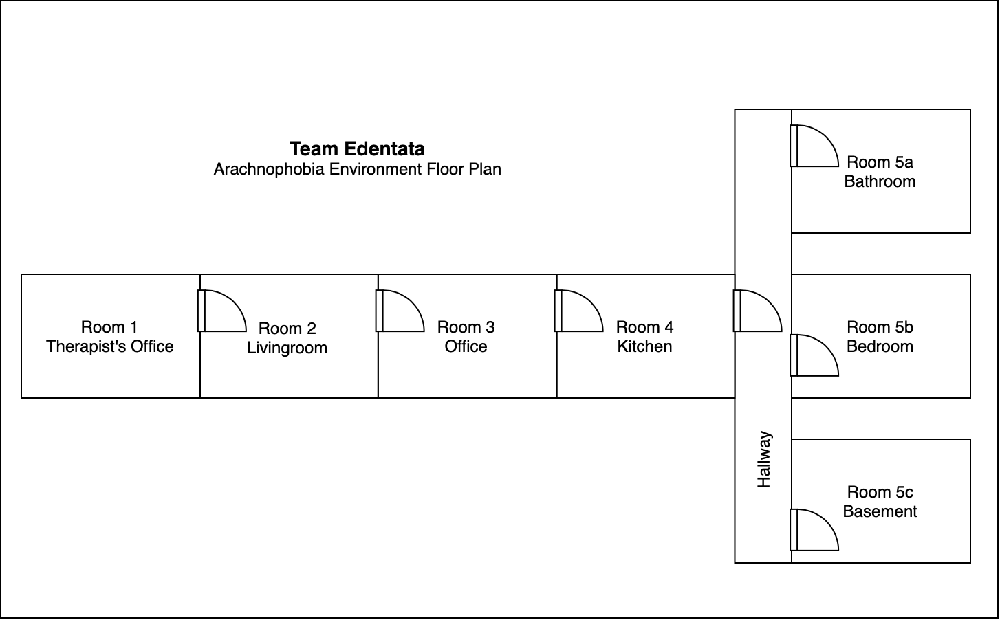

# Team Edentata VR Capstone Project

# Members
- Jacob Chapman (Business Lead, Backend Developer)
- Roxanne Harrison (Design Lead, Frontend Developer)
- Jacob Sauer (Scrum Master, Lead Developer)

# Documentation
- [Business Case](Documentation/business_case.pdf)
- [Project Requirements](Documentation/project_requirements.pdf)
- [Project Charter](Documentation/project_charter.pdf)
- [MVP 1 Progression Sequence Diagram](Documentation/environment_progression_sequence.pdf)
- [Lo-Fi Prototypes](Documentation/lo_fi_prototypes.pdf)
- [Environment Layout](Documentation/environment_layout.pdf)
- [Class Diagram](Documentation/SpiderClassDiagram.PNG)

## Scrum Notes
- [Scrum Notes #1](Documentation/Scrum_Notes_1_9-24.pdf)
- [Scrum Notes #2](Documentation/Scrum_Notes_2_10-8.pdf)

# Vlogs

- [Vlog #1](https://www.youtube.com/watch?v=nNTIOCdFI7Q)
- [Vlog #2](https://youtu.be/bdcmpIpF4jo)

# Project Idea

Our team plans to create a series of Virtual Reality (VR) environments, each having an individual focus on a particular phobia people commonly have. These scenarios will provide an interactive user experience to enhance current exposure therapy techniques. By allowing for interactivity in the virtual environment, users will be able to control the linear progression of the scene at their own pace, according to their personal comfort level.  
See below the planned room layout for the virtual environments:  

# Project Background

The greatest advantage that VR brings to exposure therapy is that it can display environments that the brain interprets as three-dimensional. This is useful for a few reasons: firstly, VR can act as an alternative in situations where real-world exposure therapy is impractical or impossible, such as air travel or being in the ocean surrounded by sharks. However, even in cases where real-world therapy is practical, there is still usually no way to control the behaviour of what is causing distress to the patient. This means that progression is difficult to personalize. In a virtual simulation however, this is not an issue. Even if the user assumes on a subconscious level that what they are seeing is real, it is not actually real, and poses no legitimate danger. As such, virtual environments are guaranteed to be safe and controlled, which creates a strong basis for exposure therapy.

Furthermore, in VR, it is relatively easy for medial tasks. For example, picking up objects and moving from room to room. What this means is that such tasks feature level-based progression and a corresponding escalation of intensity. The process of acclimating to a stimulus that normally elicits anxiety is similarly gradual. Patients can tolerate various levels of exposure at different points along their journey to overcome their phobia. Thus, the paradigm of gamification is both applicable and beneficial to this project.

# Business Need / Opportunity

VR exposure therapy has been around and explored extensively over the past few decades, primarily through research projects, but also through more than a few commercial endeavours. The main reason why none of these commercial products have taken off is that, for the most part, the user can only interact with the VR environment in a passive manner. In other words, they cannot do much more than just look around and watch things happen. In order for a VR experience to be an effective therapy tool, the user needs to be convinced of two things - that the environment itself is a physical location, and that the events taking place in the environment are legitimate and bear real consequences. 

We see an opportunity to improve upon past VR experiences used for exposure therapy by situating the user in well-constructed rooms with motion-based control schemes, rather than unrealistic or overly abstract spaces with passive interactions. Finally, conducting therapy in VR opens the door for real-time involvement on the part of the user's therapist, whether by observing the user's visual perspective and real-world disposition passively, or directly manipulating elements of the environment in accordance with their patient's comfort level. This gives users a chance to make progress at their own pace, and immediately apply coping strategies they they learn from their therapist.

# Mentor(s)

- Craig Gelowitz
- Tim Maciag

# Further Readings

- 
- 
- 
- 
- 
- 
- 
